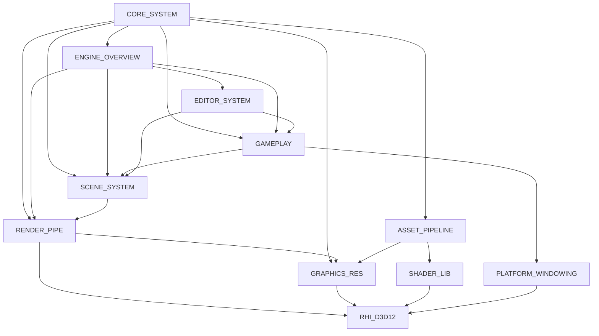

# AI Digest Index

本索引汇总 `_ai` 目录下的架构摘要，便于快速定位模块主题、覆盖目录与关键入口文件。

## 模块摘要一览

| Digest | 主题 | 覆盖目录 | 关键入口文件（示例） |
| --- | --- | --- | --- |
| [DIGEST_ENGINE_OVERVIEW](DIGEST_ENGINE_OVERVIEW.md) | 引擎入口与模块初始化、主循环与调度 | `Runtime/Entry`, `EngineCore`, `Runtime/Utils`, `Runtime/Scene`, `Runtime/GameObject` | `Runtime/Scene/SceneManager.h`, `Runtime/Core/Game.h`, `Runtime/GameObject/GameObject.h` |
| [DIGEST_CORE_SYSTEM](DIGEST_CORE_SYSTEM.md) | 核心系统（内存、ID、序列化、Profiler、任务） | `Runtime/Core`, `Runtime/Math`, `Runtime/Serialization` | `Runtime/Core/Profiler.h`, `Runtime/Core/InstanceID.h`, `Runtime/Core/PublicStruct.h` |
| [DIGEST_SCENE_SYSTEM](DIGEST_SCENE_SYSTEM.md) | Scene 管理与层级组织 | `Runtime/Scene`, `Runtime/GameObject` | `Runtime/Scene/SceneManager.h`, `Runtime/Scene/Scene.h`, `Runtime/GameObject/Transform.h` |
| [DIGEST_GAMEPLAY](DIGEST_GAMEPLAY.md) | GameObject/Component/脚本与运行时行为 | `Runtime/GameObject`, `Runtime/Scripts`, `Runtime/Managers` | `Runtime/GameObject/Transform.h`, `Runtime/GameObject/Camera.h`, `Runtime/GameObject/MonoBehaviour.h` |
| [DIGEST_RENDER_PIPE](DIGEST_RENDER_PIPE.md) | 渲染管线、Pass/Path、裁剪与调度 | `Runtime/Renderer` | `Runtime/Renderer/RenderEngine.h`, `Runtime/Renderer/RenderContext.h`, `Runtime/Renderer/RenderPipeLine/RenderPass.h` |
| [DIGEST_GRAPHICS_RES](DIGEST_GRAPHICS_RES.md) | 图形资源与 GPU 数据结构 | `Runtime/Graphics`, `Runtime/Resources` | `Runtime/Graphics/MaterialLayout.h`, `Runtime/Graphics/GPUSceneManager.h`, `Runtime/Graphics/MaterialInstance.h` |
| [DIGEST_RHI_D3D12](DIGEST_RHI_D3D12.md) | D3D12 RHI 实现 | `Runtime/Platforms/D3D12`, `Runtime/Renderer` | `Runtime/Platforms/D3D12/D3D12RenderAPI.h`, `Runtime/Platforms/D3D12/D3D12RootSignature.h`, `Runtime/Renderer/RenderCommand.h` |
| [DIGEST_PLATFORM_WINDOWING](DIGEST_PLATFORM_WINDOWING.md) | 平台窗口与输入 | `Runtime/Platforms`, `Runtime/Managers` | `Runtime/Platforms/Windows/WindowManagerWindows.h`, `Runtime/Managers/WindowManager.h`, `Runtime/Platforms/D3D12/D3D12RenderAPI.h` |
| [DIGEST_ASSET_PIPELINE](DIGEST_ASSET_PIPELINE.md) | 资源导入、元数据与序列化管线 | `Runtime/Resources`, `Runtime/Serialization`, `Meta`, `Asset` | `Runtime/Serialization/MetaData.h`, `Runtime/Serialization/AssetSerialization.h`, `Runtime/Resources/Asset.h` |
| [DIGEST_SHADER_LIB](DIGEST_SHADER_LIB.md) | Shader 资源与公共库 | `Assets/Shader` | `Assets/Shader/include/Core.hlsl`, `Assets/Shader/SimpleTestShader.hlsl`, `Assets/Shader/BlitShader.hlsl` |
| [DIGEST_EDITOR_SYSTEM](DIGEST_EDITOR_SYSTEM.md) | 编辑器系统与面板 | `Editor` | `Editor/Panel/EditorHierarchyPanel.h`, `Editor/Panel/EditorInspectorPanel.h`, `Editor/EditorGUIManager.h` |

## 模块依赖（概览）

